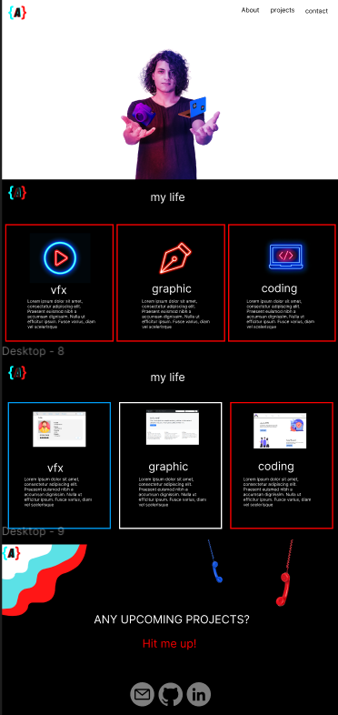

# MyPortfolio

### Author

Azzam faraj

### Description:

This project is my personal portfolio made as a part of Orange Coding Academy boot camp, and is built using HTML, CSS, and Bootstrap 5.

Links

[link] (https://www.figma.com/file/hkiRqOtDmrvAmOporxPgDI/Untitled?node-id=0%3A1)

[link] (https://azzie2000.github.io/MyPortfolio/)

